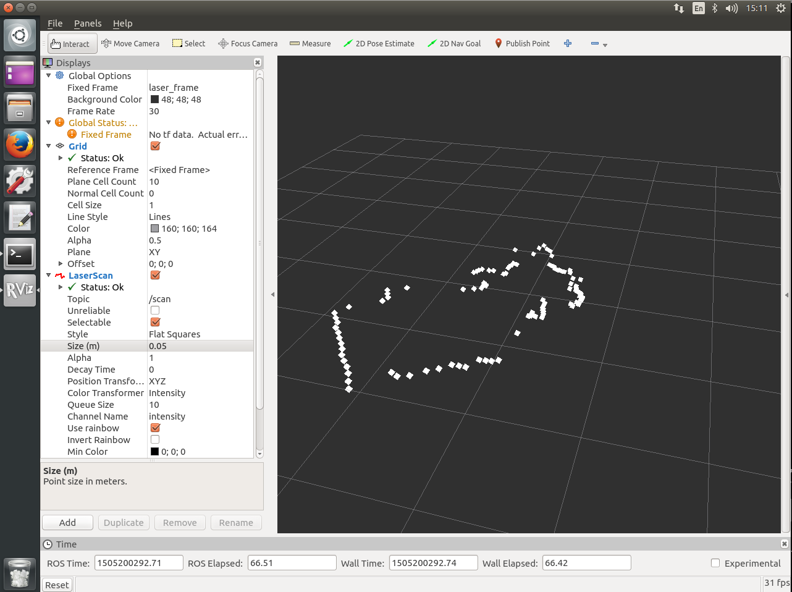

https://github.com/scanse/sweep-ros

# 步骤
- 要先安装sweep-sdk 
- mkdir ~/github
- cd ~/github/
- git clone https://github.com/scanse/sweep-sdk
- cd sweep-sdk/libsweep/
- mkdir -p build
- cd build/
- cmake .. -DCMAKE_BUILD_TYPE=Release
- cmake --build .
- sudo cmake --build . --target install
- sudo ldconfig
### Build the examples
- cd ..
- cd examples
- sudo apt-get install libsfml-dev -y # libsfml is required for the viewer example
- mkdir build
- cd build
- cmake .. -DCMAKE_BUILD_TYPE=Release
- cmake --build .
### 插上sweep运行测试
- sudo chown play /dev/ttyUSB0 #很重要，不然会报错
- cd ~/github/sweep-sdk/libsweep/build
- ./sweep-ctl /dev/ttyUSB0 get motor_speed #5
- ./sweep-ctl /dev/ttyUSB0 set motor_speed 0
- ./sweep-ctl /dev/ttyUSB0 get sample_rate #500
- ./sweep-ctl /dev/ttyUSB0 set sample_rate 1000
####  测试example
- cd ../examples/build/
- ./example-c++ /dev/ttyUSB0 
- ./example-viewer /dev/ttyUSB0 

## 安装sweep-ros
- cd ~/catkin_ws/
- source devel/setup.bash # Install prerequisite packages
- cd src
- git clone https://github.com/scanse/sweep-ros.git
- cd sweep-ros  # Install the rosdeps -a = all -y = no questions -r = skip errors 
- rosdep install -a -y -r
- cd ~/catkin_ws/
- catkin_make
- sudo -s 
- catkin_make install  -DCMAKE_INSTALL_PREFIX=/opt/ros/kinetic
- rosstack profile & rospack profile
- source devel/setup.bash
- roslaunch sweep_ros view_sweep_laser_scan.launch #打开rviz

## result 截图screenshot

## 手动启动sweep ros
- rosrun sweep_ros sweep_node
- 启动rviz
- 添加PointCloud2
- 把size(m)设为0.1
- 把Fixed Frame 改为 laser_frame
- OK

# 参考
- https://github.com/jetsonhacks/installSweep
