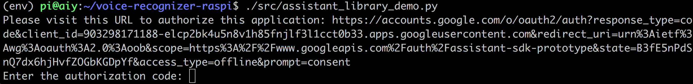
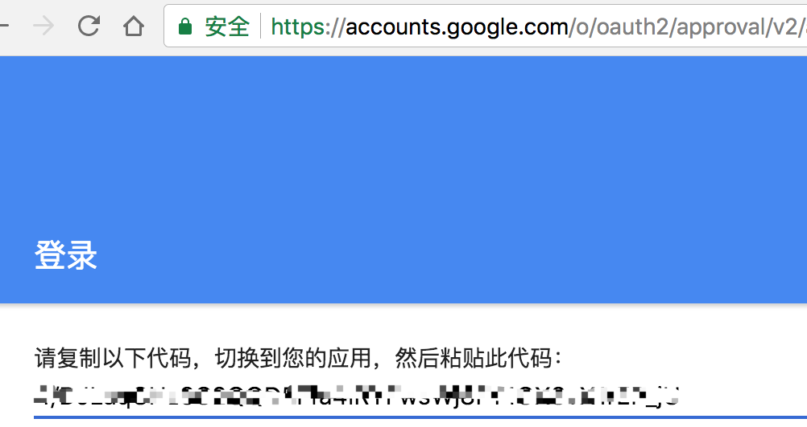

## Google AIY Voice Kit 语音助手
- 官方网站 https://aiyprojects.withgoogle.com/

- 购买
	- [淘宝](https://item.taobao.com/item.htm?spm=a1z09.2.0.0.5ff3f977LungAA&id=560254057675&_u=8envdkb13fe) 购买，台湾发货，顺丰快递，3天到北京
	- 参考视频 ：
		- [Raspberry Pi Google AIY Voice Kit](https://www.bilibili.com/video/av16126729/)
		- [Raspberry Pi Google AIY GPIO Voice Control](https://www.bilibili.com/video/av16126179/)
	- 我制作的视频：
		- [Google AIY 开箱](https://www.bilibili.com/video/av16130607/)
		- [Google AIY 安装](https://www.bilibili.com/video/av16132744/)
		
- 安装
	- 打开 官方网站 https://aiyprojects.withgoogle.com/		
	- 包装盒内有本书，按照书里的指南操作即可
	- 把树莓派接上HDMI显示器，进入系统，打开Chrome浏览器，书签里有2个收藏
		- [Google Cloud Console](https://console.cloud.google.com/)
		- 
	- 申请好Google Assistant和Google Voice服务，就可以进行测试了。
	- 对于国内用户，因为被墙，不能之间使用Google服务器，需要试用代理或VPN
		- 我使用了http_proxy,因为它们都是Python程序，在终端里运行，所以在~/.bashrc底部输入
			- export http_proxy='http://192.168.0.109:50493'
			- export https_proxy='http://192.168.0.109:50493'
		- 虽然能用，还是导致一些问题。
		- VPN可能比较好用
		- shadowsocks在树莓派里配置也挺麻烦的
- 运行测试程序
    - 加载虚拟环境source ~/AIY-voice-kit-python/env/bin/activate
    - 测试 cd ~/AIY-voice-kit-python/
        - ./checkpoint/check_audio.py
        - ./checkpoint/check_wifi.py
        - ./checkpoint/check_cloud.py
    - 运行语音助手
        - ./src/assistant_library_demo.py
            - 第一次运行，会提示你打开浏览器，登录谷歌进行认证
            - 
            - 有个问题，认证结束后，它不会跳转到终端里，需要你复制认证结果URL
            - 推荐远程登录到树莓派，然后在ssh里运行assistant_library_demo.py，它提示你拷贝认证URL到你的工作电脑上，然后把返回的认证code复制到ssh里，成功认证
            - 
            - 然后就正常运行了。
        - ./src/assistant_grpc_demo.py 我只有这个程序成功运行。
    - Update 2017-11-14
        - sudo /usr/sbin/ntpdate -u pool.ntp.org
        - 然后再运行assistant_library_demo.py ，顺利运行，没有报错，能说OK Google
        - 但过了几分钟后，还会报错SSL Handshake failed
        - assistant_library_with_button_demo.py 比较好用
        
        
- 实验结果-视频
	- [ GOOGLE AIY 语音助手测试：谁是第一个登上月亮的人？](https://www.bilibili.com/video/av16132773/)