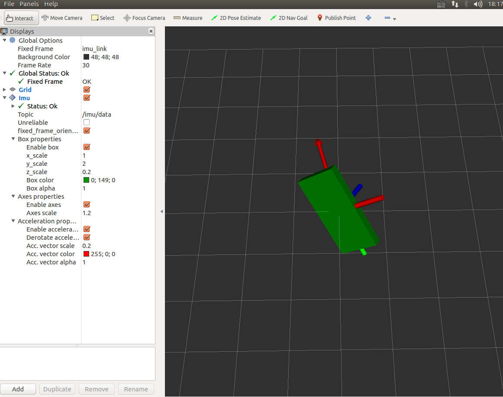

## ROS中使用MPU6050 http://www.rosclub.cn/post-521.html

### 问题
- imu数据输出一段时间内，会停止输出！
- Arduino 自动重启？？

## 安装mpu6050 库
- 下载 http://diyhacking.com/projects/MPU6050.zip 和 http://diyhacking.com/projects/I2Cdev.zip，解压后放到Arduino的libraries目录下，重启Arduino.

## 在ROS中应用

在ROS的工作目录下，下载和编译代码，其中imu_tools是为了添加rviz_imu_plugin，以便于在rviz中可视化。
```bash
cd ~catkin_ws/src/
git clone https://github.com/fsteinhardt/mpu6050_serial_to_imu
git clone https://github.com/ccny-ros-pkg/imu_tools
sudo apt-get install ros-indigo-serial
cd ~catkin_ws/
catkin_make --pkg  mpu6050_serial_to_imu imu_tools
source  devel/setup.bash 

```
- 上传mpu6050_serial_to_imu/arduino/MPU6050/MPU6050.ino 到 Arduino Mega
运行如下命令，就可以把mpu6050的值转换为ROS的/imu 消息，同时通过rviz看到mpu6050朝向的变化。
- roslaunch mpu6050_serial_to_imu demo.launch




## 使用图书《[ROS机器人高效编程](https://item.jd.com/12169587.html)》的代码来显示
- rosrun mpu6050_serial_to_imu mpu6050_serial_to_imu_node 
- roslaunch razor_imu_9dof razor-display.launch
	