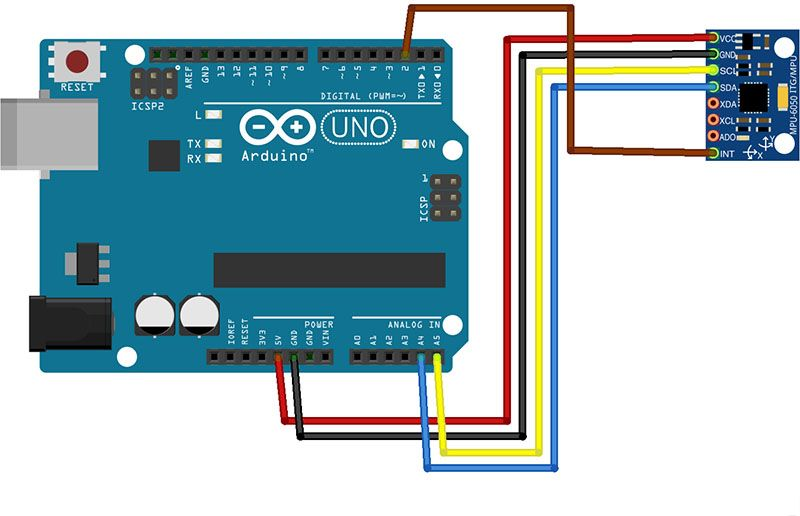

## 测试 MPU6050
- MPU6050介绍https://www.stinson.cool/mpu-6050-introduction/
### 接线
- VCC > 5V
- GND > GND
- INT > 数字2
- UNO 
    - SCL > A5
    - SDA > A4
- MEGA 2560
    - SCL > SCL 
    - SDA > SDA 

    
   
### 官方代码
```arduino
 // MPU-6050 Short Example Sketch
// By Arduino User JohnChi
// August 17, 2014
// Public Domain
#include<Wire.h>
const int MPU_addr=0x68;  // I2C address of the MPU-6050
int16_t AcX,AcY,AcZ,Tmp,GyX,GyY,GyZ;
void setup(){
  Wire.begin();
  Wire.beginTransmission(MPU_addr);
  Wire.write(0x6B);  // PWR_MGMT_1 register
  Wire.write(0);     // set to zero (wakes up the MPU-6050)
  Wire.endTransmission(true);
  Serial.begin(9600);
}
void loop(){
  Wire.beginTransmission(MPU_addr);
  Wire.write(0x3B);  // starting with register 0x3B (ACCEL_XOUT_H)
  Wire.endTransmission(false);
  Wire.requestFrom(MPU_addr,14,true);  // request a total of 14 registers
  AcX=Wire.read()<<8|Wire.read();  // 0x3B (ACCEL_XOUT_H) & 0x3C (ACCEL_XOUT_L)     
  AcY=Wire.read()<<8|Wire.read();  // 0x3D (ACCEL_YOUT_H) & 0x3E (ACCEL_YOUT_L)
  AcZ=Wire.read()<<8|Wire.read();  // 0x3F (ACCEL_ZOUT_H) & 0x40 (ACCEL_ZOUT_L)
  Tmp=Wire.read()<<8|Wire.read();  // 0x41 (TEMP_OUT_H) & 0x42 (TEMP_OUT_L)
  GyX=Wire.read()<<8|Wire.read();  // 0x43 (GYRO_XOUT_H) & 0x44 (GYRO_XOUT_L)
  GyY=Wire.read()<<8|Wire.read();  // 0x45 (GYRO_YOUT_H) & 0x46 (GYRO_YOUT_L)
  GyZ=Wire.read()<<8|Wire.read();  // 0x47 (GYRO_ZOUT_H) & 0x48 (GYRO_ZOUT_L)
  Serial.print("AcX = "); Serial.print(AcX);
  Serial.print(" | AcY = "); Serial.print(AcY);
  Serial.print(" | AcZ = "); Serial.print(AcZ);
  Serial.print(" | Tmp = "); Serial.print(Tmp/340.00+36.53);  //equation for temperature in degrees C from datasheet
  Serial.print(" | GyX = "); Serial.print(GyX);
  Serial.print(" | GyY = "); Serial.print(GyY);
  Serial.print(" | GyZ = "); Serial.println(GyZ);
  delay(333);
  Serial.println();
}
```
- 上传代码，打开串口，码率为9600，便可看到输出
## 使用 MPU6050库
- 参考 https://www.stinson.cool/arduino-mpu-6050-tutorial/
- 下载 http://diyhacking.com/projects/MPU6050.zip 和 http://diyhacking.com/projects/I2Cdev.zip，解压后放到Arduino的libraries目录下，重启Arduino
- 使用 Examples中 MPU6050_raw和MPU6050_DMP6 测试