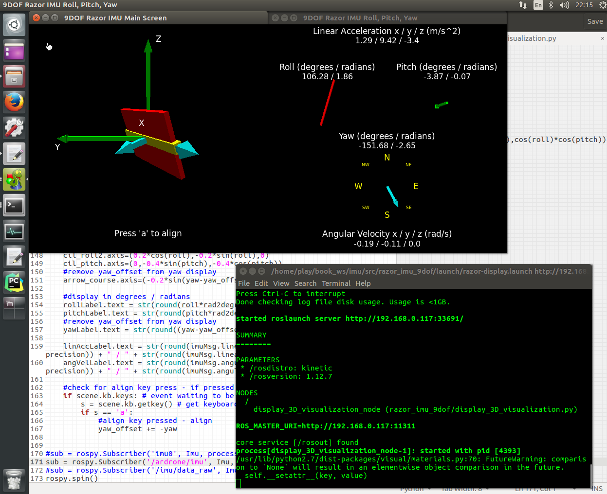

# 测试IMU并播放

## 购买IMU ,淘宝都有销售
- [SparkFun 9DoF Razor IMU (SEN-10736)](https://www.sparkfun.com/products/retired/10736)
	- 很多教程都用这款，但这款退役了。而且需要自己焊接，并购买[SparkFun FTDI Basic Breakout - 3.3V](https://www.sparkfun.com/products/9873) USB接口才能使用，麻烦。
- [SparkFun 9DoF Razor IMU M0 (SEN-14001)](https://www.sparkfun.com/products/14001) 这个是最新款，但是[ROS官方教程razor_imu_9dof](https://github.com/KristofRobot/razor_imu_9dof)不支持这款IMU，芯片都不一样，没人支持后续开发。
	- [SparkFun 9DoF Razor IMU M0上手指南](https://learn.sparkfun.com/tutorials/9dof-razor-imu-m0-hookup-guide)
- mpu6050 模块 最便宜！！ [淘宝](https://s.taobao.com/search?spm=a230r.1.0.0.4e2014bbTmXAao&q=mpu6050+模块&rs=up&rsclick=2&preq=mpu6050&sort=sale-desc)
	- 参考：[加速度计和陀螺仪融合得到精确角度](http://www.arduino.cn/thread-18392-1-1.html)


## 使用rosbag文件体验IMU
- 文件https://github.com/ccny-ros-pkg/imu_tools/tree/indigo/imu_filter_madgwick/sample
	- ardrone_imu.bag 好用
	- phidgets_imu_upside_down.bag
	- sparkfun_razor.bag
- 下载bag文件 svn export https://github.com/ccny-ros-pkg/imu_tools/trunk/imu_filter_madgwick/sample
- 文件详情 ：rosbag info ardrone_imu.bag
```
path:        ardrone_imu.bag
version:     2.0
duration:    1:32s (92s)
start:       Nov 14 2012 23:33:24.59 (1352907204.59)
end:         Nov 14 2012 23:34:56.00 (1352907297.00)
size:        2.1 MB
messages:    8616
compression: none [3/3 chunks]
types:       geometry_msgs/Vector3Stamped [7b324c7325e683bf02a9b14b01090ec7]
             sensor_msgs/Imu              [6a62c6daae103f4ff57a132d6f95cec2]
topics:      /ardrone/imu   4308 msgs    : sensor_msgs/Imu
             /ardrone/mag   4308 msgs    : geometry_msgs/Vector3Stamped	
```
- 播放	rosbag play ardrone_imu.bag
- rostopic echo /ardrone/imu
- 使用vpython进行可视化
	- 安装 git clone https://github.com/KristofRobot/razor_imu_9dof.git
	- 修改 topic ：razor_imu_9dof/nodes/display_3D_visualization.py 
		- sub = rospy.Subscriber('/ardrone/imu', Imu, processIMU_message)
	- roslaunch razor_imu_9dof razor-display.launch
	