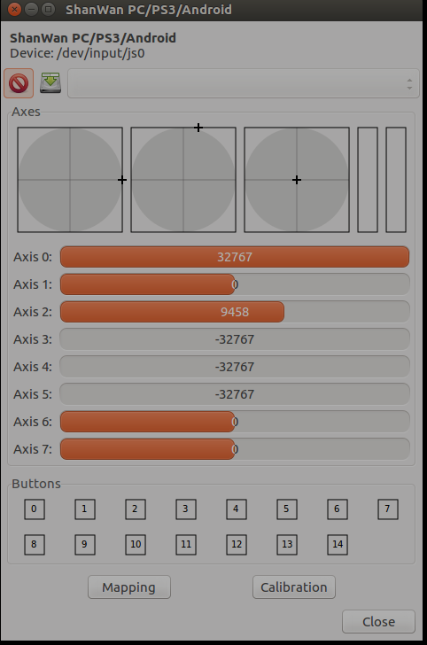

# PS2震动usb2.4g无线游戏手柄
- 购买链接：https://item.taobao.com/item.htm?id=35391805818
- 支持Ubuntu，免驱动
- 使用：
	- First, install the Joystick input driver package:
	- sudo apt-get install joystick
	- Next, install the Joystick Configuration package:
	- sudo apt-get install jstest-gtk
	- 安装：开源模拟飞行器flightgear
	- sudo apt install flightgear
- 调试
	- jstest-gtk
	- 