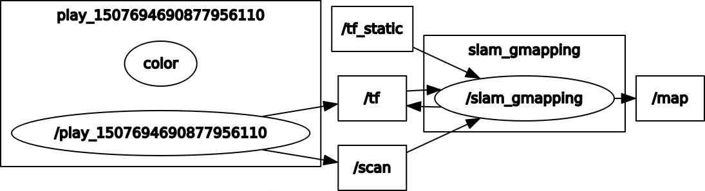

# gmapping 教程
- 参考链接：[ROS中级二 利用Rviz实时观测模拟SLAM过程](http://stevenshi.me/2017/07/11/ros-intermediate-tutorial-2/)

## 步骤
- ROS 启用重放时的数据中的时间不是现在的本地时间，而是历史时间，因此我们需要告诉 ROS 系统，我们使用历史模拟时间：
	- rosparam set use_sim_time true
- gmapping 需要两个输入，一个为激光雷达数据，另外一个是全局 tf转换关系，这个 tf 中需要一个里程计数据以构建坐标系。
	- rosrun gmapping slam_gmapping scan:=scan
- 重放激光扫描的数据记录
	- rosbag play -l --clock Lecture3SLAM_Tutorial.bag 
- 启动 Rviz
	- rosrun rviz rviz
		- 设置FIxed Frame：laser #使用 rostopic echo /scan 找到frame_id
		- LaserScan：Topic ：scan  #rosbag 播放 激光bag文件时所用的topic

## Node graph
