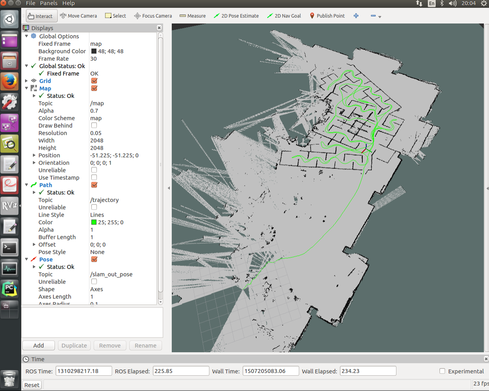

## 使用rosbag-激光扫描数据实现SLAM地图
教程：[How to build a Map Using Logged Data](http://wiki.ros.org/hector_slam/Tutorials/MappingUsingLoggedData)

- 安装hector-slam
	- sudo apt-get install ros-kinetic-hector-slam*
- 下载Team_Hector_MappingBox_RoboCup_2011_Rescue_Arena.bag
	- https://github.com/uscrs-art/beohawk-ros/blob/master/hector_slam/Team_Hector_MappingBox_RoboCup_2011_Rescue_Arena.bag
- 运行hector-slam
	- roslaunch hector_slam_launch tutorial.launch
	
- 播放bag文件，激光扫描数据和tf数据
	- rosbag play Team_Hector_MappingBox_RoboCup_2011_Rescue_Arena.bag  --clock
- 保存地图
	- rosrun map_server map_saver -f RoboCup_2011_Rescue_Arena
	
#截图
