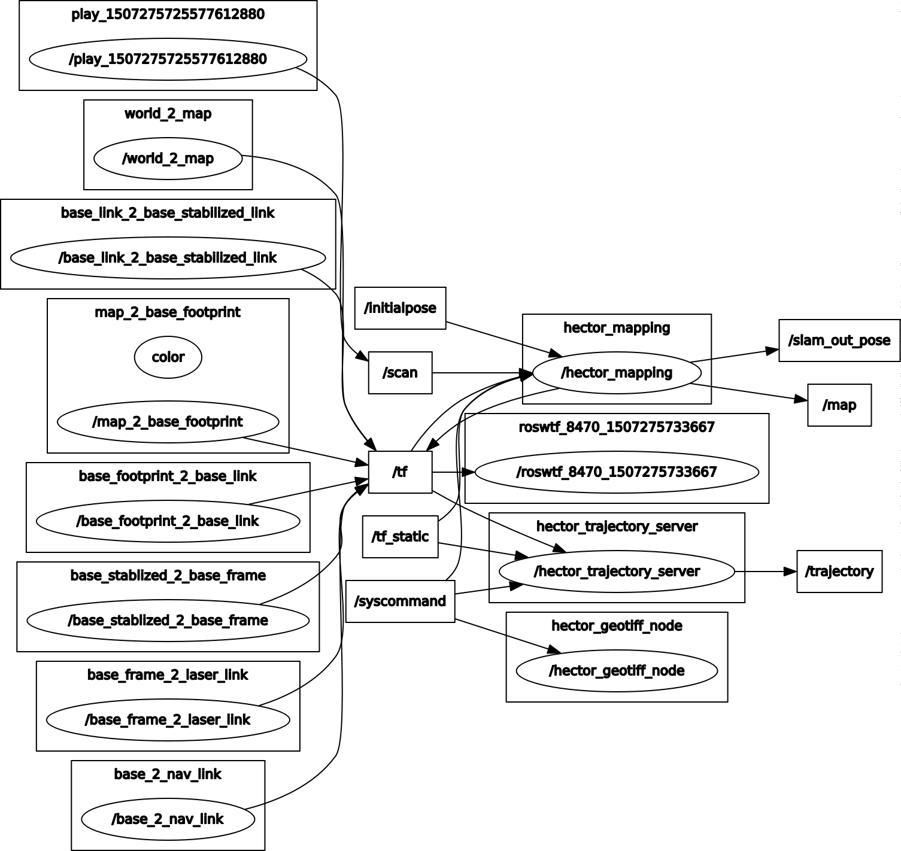
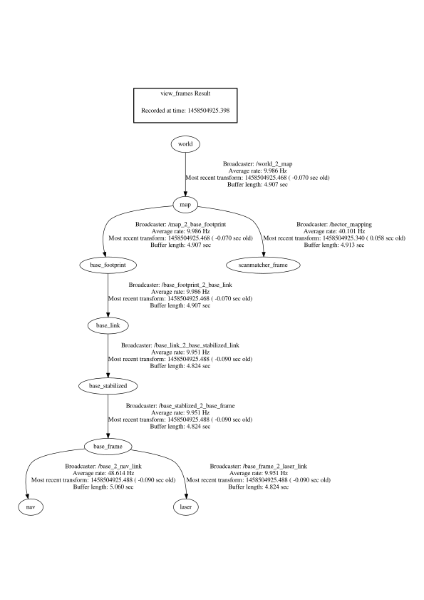

## 自定义TF,实现SLAM
参考链接：
- 主要：https://answers.ros.org/question/206389/hector-slam/
```xml
<!-- TF publish-->
<node pkg="tf" type="static_transform_publisher" name="world_2_map" args="0 0 0 0 0 0  /world /map 100" />
<node pkg="tf" type="static_transform_publisher" name="map_2_base_footprint" args="0 0 0 0 0 0 /map /base_footprint 100"/>
<node pkg="tf" type="static_transform_publisher" name="base_footprint_2_base_link" args="0 0 0 0 0 0 /base_footprint /base_link 100"/>
<node pkg="tf" type="static_transform_publisher" name="base_link_2_base_stabilized_link" args="0 0 0 0 0 0 /base_link /base_stabilized 100"/>
<node pkg="tf" type="static_transform_publisher" name="base_stablized_2_base_frame" args="0 0 0 0 0 0 /base_stabilized /base_frame 100"/>
<node pkg="tf" type="static_transform_publisher" name="base_2_nav_link" args="0 0 0 0 0 0 /base_frame /nav 100"/>
<node pkg="tf" type="static_transform_publisher" name="base_frame_2_laser_link" args="0 0 0 0 0 0 /base_frame /laser 100"/>
```
- 次要：https://answers.ros.org/question/234365/hector_slam-not-working-with-my-bag-file/
- 官方资料：http://wiki.ros.org/hector_slam/Tutorials/SettingUpForYourRobot
    - Use without odom frame
```xml
    <param name="pub_map_odom_transform" value="true"/>
    <param name="map_frame" value="map" />
    <param name="base_frame" value="base_frame" />
    <param name="odom_frame" value="base_frame" />
```    

## 步骤
- 主要参考：http://f1tenth.org/session3t
- roscd hector_slam_launch/launch/
- 修改参数 sudo gedit tutorial_f10.launch  & 
- 运行rviz roslaunch hector_slam_launch tutorial_f10.launch
- 播放rosbag文件 rosbag play --clock Lecture3SLAM_Tutorial.bag
- 保存地图 rosrun map_server map_saver -f Lecture3SLAM_Tutorial


## 调试
- rosrun rqt_graph rqt_graph 

- roswtf
```bash
play@ros:~$ roswtf 
Loaded plugin tf.tfwtf
No package or stack in context
================================================================================
Static checks summary:

No errors or warnings
================================================================================
Beginning tests of your ROS graph. These may take awhile...
analyzing graph...
... done analyzing graph
running graph rules...
... done running graph rules
running tf checks, this will take a second...
... tf checks complete

Online checks summary:

Found 1 warning(s).
Warnings are things that may be just fine, but are sometimes at fault

WARNING The following node subscriptions are unconnected:
 * /hector_mapping:
   * /tf_static
   * /syscommand
 * /rqt_gui_py_node_5890:
   * /statistics
 * /rviz:
   * /tf_static
   * /map_updates
 * /hector_geotiff_node:
   * /syscommand
 * /hector_trajectory_server:
   * /tf_static
   * /syscommand

```
- rosrun tf tf_monitor 
```bash
play@ros:~$ rosrun tf tf_monitor 
[ INFO] [1507275832.086490705]: tf_monitor waiting for time to be published
[ INFO] [1507275833.187783652]: tf_monitor waiting for time to be published
[ INFO] [1507275834.289528327]: tf_monitor waiting for time to be published


RESULTS: for all Frames

Frames:
Frame: /base_footprint published by unknown_publisher Average Delay: -0.1 Max Delay: 0
Frame: /base_frame published by unknown_publisher Average Delay: -0.1 Max Delay: 0
Frame: /base_link published by unknown_publisher Average Delay: -0.1 Max Delay: 0
Frame: /base_stabilized published by unknown_publisher Average Delay: -0.1 Max Delay: 0
Frame: /laser published by unknown_publisher Average Delay: -0.1 Max Delay: 0
Frame: /map published by unknown_publisher Average Delay: -0.1 Max Delay: 0
Frame: /nav published by unknown_publisher Average Delay: -0.1 Max Delay: 0

All Broadcasters:
Node: unknown_publisher 7e+08 Hz, Average Delay: -0.1 Max Delay: 0

```
- rosrun tf view_frames 
